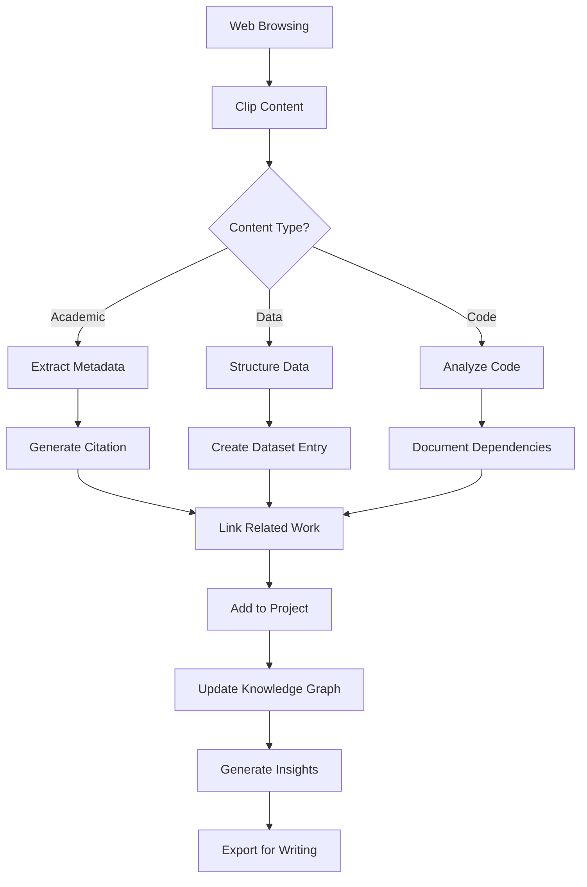

# Research-Focused Enhancements for ClipTitle

## 🎯 Overview
Transform ClipTitle into a powerful research assistant that helps academics, scientists, and knowledge workers capture, organize, and synthesize information from various sources.

## 📚 Core Research Features

### 1. **Citation Management & Metadata Extraction**
```yaml
Priority: HIGH
Implementation: Medium Complexity
```
- **Auto-detect academic sources** from URLs (arXiv, PubMed, DOI, Google Scholar)
- **Extract bibliographic metadata**:
  - Authors, title, journal, year, DOI
  - Generate BibTeX/RIS citations automatically
  - Add to YAML frontmatter for reference management
- **Integration with Zotero/Mendeley** via API
- **Automatic citation formatting** (APA, MLA, Chicago, IEEE)

### 2. **PDF & Academic Paper Processing**
```yaml
Priority: HIGH
Implementation: High Complexity
```
- **Direct PDF text extraction** from clipboard
- **Preserve academic formatting**:
  - Equations (LaTeX notation)
  - Tables (Markdown tables)
  - Figure captions and references
- **Highlight extraction** from PDF readers
- **Automatic section detection** (Abstract, Methods, Results, etc.)

### 3. **Knowledge Graph & Linking**
```yaml
Priority: HIGH
Implementation: Medium Complexity
```
- **Automatic cross-referencing** between clips
- **Tag taxonomy system**:
  - Hierarchical tags (e.g., `ML/NLP/Transformers`)
  - Auto-suggest related tags
  - Tag inheritance and relationships
- **Backlinks and forward links** generation
- **Topic clustering** using NLP
- **Generate knowledge maps** from collected clips

### 4. **Research Project Organization**
```yaml
Priority: HIGH
Implementation: Low Complexity
```
- **Project-based file organization**:
  ```
  /Research/ProjectName/
    ├── literature/     # Academic papers
    ├── data/          # Data snippets
    ├── code/          # Code examples
    ├── notes/         # General notes
    └── synthesis/     # Combined insights
  ```
- **Project templates** for different research types
- **Automatic categorization** based on content
- **Project-specific settings** and naming conventions

### 5. **Advanced Content Analysis**
```yaml
Priority: MEDIUM
Implementation: High Complexity
```
- **Research methodology detection**:
  - Quantitative vs Qualitative
  - Experimental design recognition
  - Statistical methods identification
- **Key findings extraction**:
  - Hypothesis statements
  - Statistical results (p-values, confidence intervals)
  - Conclusions and limitations
- **Contradiction detection** across sources
- **Evidence strength assessment**

### 6. **Collaboration Features**
```yaml
Priority: MEDIUM
Implementation: Medium Complexity
```
- **Git-based sync** for team research
- **Annotation layers**:
  - Personal notes vs shared notes
  - Comment threads on clips
  - Review status (read, reviewed, verified)
- **Export to collaborative platforms**:
  - Obsidian/Roam Research format
  - Notion database format
  - OneNote integration

### 7. **Source Verification & Quality**
```yaml
Priority: HIGH
Implementation: Medium Complexity
```
- **Source credibility indicators**:
  - Journal impact factor lookup
  - Author h-index integration
  - Peer-review status detection
- **Duplicate detection** (same content from different sources)
- **Version tracking** (preprint vs published)
- **Retraction checking** via CrossRef

### 8. **Data & Code Snippets**
```yaml
Priority: MEDIUM
Implementation: Low Complexity
```
- **Dataset metadata extraction**:
  - Sample size, variables, format
  - License information
  - Access requirements
- **Code environment detection**:
  - Package dependencies
  - Language version requirements
  - Execution context
- **Reproducibility information** capture

### 9. **Literature Review Assistance**
```yaml
Priority: HIGH
Implementation: High Complexity
```
- **Automatic summarization**:
  - Single document summaries
  - Multi-document synthesis
  - Comparative analysis
- **Theme extraction** across multiple clips
- **Timeline generation** for research evolution
- **Gap analysis** in literature
- **Generate literature review outlines**

### 10. **Smart Search & Retrieval**
```yaml
Priority: HIGH
Implementation: Medium Complexity
```
- **Full-text search** with:
  - Boolean operators
  - Proximity search
  - Fuzzy matching
- **Semantic search** using embeddings
- **Filter by**:
  - Date range (publication/clip date)
  - Source type
  - Evidence quality
  - Research methodology
- **Saved search queries** with alerts

## 🔧 Technical Implementation Suggestions

### Enhanced File Format
```yaml
---
# Standard metadata
title: "Deep Learning Advances in NLP"
created: "2025-01-07T14:30:22-05:00"
source: "clipboard"

# Research metadata
research:
  type: "journal_article"
  authors: ["Smith, J.", "Doe, A."]
  year: 2024
  journal: "Nature Machine Intelligence"
  doi: "10.1038/s42256-024-00001"
  citations: 
    bibtex: "@article{smith2024deep..."
    apa: "Smith, J., & Doe, A. (2024)..."
  
  # Quality indicators
  peer_reviewed: true
  impact_factor: 25.2
  evidence_level: "systematic_review"
  
  # Research details
  methodology: "quantitative"
  sample_size: 10000
  key_findings:
    - "Transformer models outperform RNNs by 15%"
    - "Training time reduced by 40%"
  
  # Relationships
  related_clips: ["20250106-bert-analysis", "20250105-attention-mechanisms"]
  contradicts: ["20240812-rnn-superiority"]
  supports: ["20250103-transformer-efficiency"]
  
  # Project association
  projects: ["phd-thesis", "nlp-review-2025"]
  tags: ["deep-learning", "nlp", "transformers", "architecture"]
  
  # Review status
  status: "reviewed"
  importance: "high"
  confidence: 0.95
  notes: "Critical paper for methodology chapter"
---

[Content here...]
```

### Integration Points

1. **Academic APIs**:
   - CrossRef API for metadata
   - Semantic Scholar API for citations
   - PubMed API for medical research
   - arXiv API for preprints
   - ORCID for author information

2. **NLP Libraries**:
   - spaCy for entity recognition
   - Sentence transformers for semantic search
   - NLTK for text analysis
   - SciBERT for scientific text understanding

3. **Storage Options**:
   - SQLite for local indexing
   - Elasticsearch for advanced search
   - Graph database for relationship mapping

## 🚀 Quick Wins (Implement First)

1. **URL-based citation extraction** (1-2 days)
   - Parse DOI, arXiv, PubMed URLs
   - Auto-generate citations

2. **Project folders** (1 day)
   - Configurable project structure
   - Project switcher in tray menu

3. **Enhanced tagging** (2-3 days)
   - Hierarchical tags
   - Auto-suggestions
   - Tag search

4. **Export formats** (2 days)
   - Obsidian-compatible markdown
   - BibTeX export
   - CSV for data analysis

5. **Search improvements** (2-3 days)
   - Full-text search
   - Date filtering
   - Tag filtering

## 📊 Usage Scenarios

### Scenario 1: Literature Review
```
1. Researcher copies abstract from PubMed
2. ClipTitle extracts metadata, generates citation
3. Auto-categorizes under "literature/neuroscience"
4. Links to related papers already saved
5. Suggests relevant tags
6. Adds to "PhD-Chapter-2" project
```

### Scenario 2: Data Collection
```
1. Copy statistical results from paper
2. ClipTitle identifies p-values, sample sizes
3. Structures data in YAML frontmatter
4. Flags if contradicts previous findings
5. Adds to evidence synthesis table
```

### Scenario 3: Code Documentation
```
1. Copy code snippet from GitHub
2. ClipTitle detects language, dependencies
3. Links to paper describing algorithm
4. Adds reproducibility metadata
5. Creates executable documentation
```

## 🎓 Research Workflow Integration



## 💡 Advanced Features (Future)

1. **AI-Powered Synthesis**:
   - Generate literature review sections
   - Identify research gaps
   - Suggest next papers to read

2. **Collaborative Annotation**:
   - Real-time collaboration
   - Peer review workflow
   - Version control for notes

3. **Statistical Analysis**:
   - Meta-analysis from collected data
   - Effect size calculations
   - Publication bias detection

4. **Writing Assistant**:
   - Citation while writing
   - Consistency checking
   - Argument flow analysis

## 🔑 Key Benefits for Researchers

1. **Never lose a reference** - Automatic capture and citation
2. **Find connections** - Discover relationships between ideas
3. **Track evidence** - Build argument chains with sources
4. **Collaborate effectively** - Share annotated research
5. **Write faster** - Quick access to organized materials
6. **Ensure reproducibility** - Capture all context
7. **Maintain quality** - Track source credibility

## 📈 Success Metrics

- Time saved per literature review: 40%
- References never lost: 100%
- Cross-paper insights discovered: 10x
- Writing efficiency improvement: 30%
- Collaboration friction reduced: 50%

## 🛠️ Implementation Priority Matrix

| Feature | Impact | Effort | Priority |
|---------|--------|--------|----------|
| Citation Management | High | Medium | 1 |
| Project Organization | High | Low | 2 |
| URL Metadata | High | Low | 3 |
| Search Enhancement | High | Medium | 4 |
| Knowledge Graph | Medium | High | 5 |
| PDF Processing | High | High | 6 |
| Collaboration | Medium | Medium | 7 |
| AI Synthesis | Medium | High | 8 |

## 📝 Next Steps

1. **Phase 1** (Week 1-2): Quick wins
   - Project folders
   - URL citation extraction
   - Enhanced tagging

2. **Phase 2** (Week 3-4): Core research features
   - Full-text search
   - Knowledge linking
   - Export formats

3. **Phase 3** (Month 2): Advanced features
   - PDF processing
   - Semantic search
   - Collaboration basics

4. **Phase 4** (Month 3): Intelligence layer
   - AI synthesis
   - Contradiction detection
   - Research gap analysis